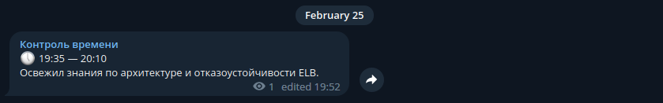
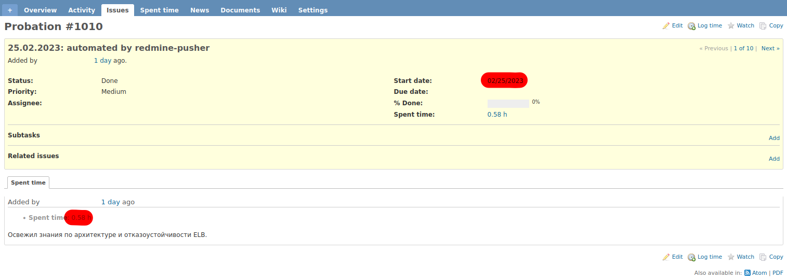

## Telegram-Redmine sync for time tracking activity

### Motivation
Time tracking via default Redmine web interface is quite time-consuming and leads to lots of mistakes due to inavailability to edit and delete your issues or log time.

That's a reason why I decided to manage my time tracking activity in smart way via Telegram Channel.
This project is aimed to sync any data between Telegram Channel and Redmine, so you're free of routine to move data manually.

### Architecture
Project consists of two Docker images:
1. **poll_channels** is responsible for interaction with Telegram API in order to export, parse and publish channel posts.
2. **redmine_pusher** is responsible for interaction with Redmine API in order to import data gathered from **poll_channels** HTTP endpoint.

### Usage

Follow these steps to deploy this solution:
1. Create Telegram Channel (either private or public one). 
2. Pull the repository, create environment file and configuration file.
3. Create authentication file for interacting with Telegram API.
4. Run `docker compose up -d --build` to get this stuff up & working.

#### Step #1: Telegram Channel message format

When you create your own telegram channel for time tracking, you have to follow format rules required by project to properly parse data.

Parse template can be customized in **poll_channels** configuration (**template** directive), however the default one works as described:
1. Every telegram message is an atomic unit of your activity and it's parsed line by line
2. 1st line has to contain two entries of regex `\d\d:\d\d`, other chars are ignored
3. 2-6 lines are parsed as description using regex `.*`
4. 7+ lines are not parsed and totally ignored

#### Step #2: create environment and configuration files
Generate an environment file that's required by Docker Compose:
```
# in the root of project

echo "
COMPOSE_PROJECT_NAME=redmine-integration
PYTHONPATH=.
TZ=Europe/Minsk
LOGLEVEL=INFO

# poll channels
SESSION_NAME=redmine-integration
LISTEN_ADDRESS=0.0.0.0:8080
PHONE=<YOUR-TELEGRAM-PHONE-NUMBER>
API_ID=<API-ID-FOR-TELEGRAM>
API_HASH=<API-HASH-FOR-TELEGRAM>


# redmine pusher
POLL_CHANNELS_URL=http://telegram-poll-channels:8080/data
REDMINE_ADDR=<REDMINE-ADDRESS in format http://domain-name.com>
REDMINE_API_KEY=<REDMINE-ACCESS-API-KEY>
MAX_DAYS=7
" > .env
```

Generate configuration file that's required by **poll_channels** module based on [example.yml](./example.yml) file and placed it in `./secrets` directory:
```shell
# in the root of project

mkdir -p ./secrets
cp example.yml ./secrets/config.yml
nano ./secrets/config.yml
```


#### Step #3: create authentication file
In order to be working **poll_channels** modules needs Telegram account to access Telegram API. Follow the authentication process to create a session file: 

```shell
# in the project root directory

mkdir -p ./secrets
pipenv install
pipenv run python3 session_handler/main.py
```


### Screenshots

Messages in Telegram Channel:



Created issue with imported messages in Redmine:



### Q&A


##### What data is pushed to Redmine?

Rules to determine whether data should be pushed are as follows:
- Data is **NOT** pushed if published today.
- Data is **NOT** pushed if published after `MAX_DAYS` from today.
- Data is **NOT** pushed if published day is equal to `start_date` value for any of the last 15 issues in your `project_id`.
- Any other data is pushed to a newly created issue with `start_date` set to the published day.

##### When data is pushed?

From **10:00** until **23:59** according to your system time. 


##### How often it checks whether new data is available and has to be pushed?

- **poll_channels** reads Telegram channel every 30 minutes by default, but it can be overrided by setting `polling_interval` (in seconds) via `config.yml`.
- **redmine_pusher** checks for new data every 30 minutes, but can be overrided by setting  `POLL_INTERVAL` (in seconds) via environment variable.